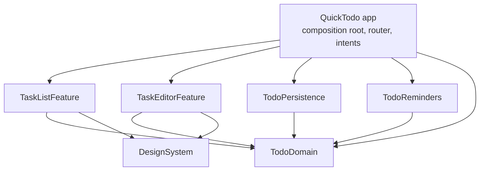

# Architecture

QuickTodo is small on purpose, but I've structured it the way I'd structure a bigger app: clear module boundaries, one composition root, value types across every boundary and tests at each layer. This document explains how the pieces fit and why.

## Module graph

All shared code lives in one local Swift package, `Packages/QuickTodoKit`, split into several targets. The app target is a thin shell that wires them together.



| Target | Contents | Depends on |
| --- | --- | --- |
| `TodoDomain` | `TodoItem`, `TaskFilter`, `TaskDraft` (validation), the `TodoStore` and `ReminderScheduling` protocols, `Reminder`, `ReminderSyncingStore`, `DateProvider`, `InMemoryTodoStore` for previews | Foundation only |
| `TodoPersistence` | `CoreDataStack`, the `TaskDetails` managed object, `CoreDataTodoStore`, and the `.xcdatamodeld` as a package resource | `TodoDomain`, Core Data |
| `TodoReminders` | `NotificationReminderScheduler` and a thin `NotificationCenterClient` over `UNUserNotificationCenter` | `TodoDomain`, UserNotifications |
| `DesignSystem` | Spacing and radius tokens, status and brand colors, `PrimaryButtonStyle`, `GradientBackground`, `FloatingAddButton` | SwiftUI |
| `TaskListFeature` | `TaskListView`, `TaskRowView`, `TaskListViewModel` | `TodoDomain`, `DesignSystem` |
| `TaskEditorFeature` | `TaskEditorView` | `TodoDomain`, `DesignSystem` |
| `TodoTestSupport` | `MockTodoStore`, `MockReminderScheduler` (test-only, not a product) | `TodoDomain` |

The rules that keep this honest:

- Features never import each other. The list doesn't know the editor exists. It reports "add" and "edit this item", and the app decides what to present.
- Features never import Core Data or UserNotifications. They only see `TodoStore` and value types.
- `TodoDomain` has no UI or framework dependencies beyond Foundation, so it compiles and tests in isolation.

### Why one package with several targets

I went with a single `QuickTodoKit` package instead of one package per module. Target boundaries already enforce visibility, because `internal` really is internal across targets. One manifest keeps platforms, Swift settings and the test layout in one place, and the Xcode project references a single local package. If one of these modules were ever shared with another app, I'd split it into its own package then. See [ADR 0001](docs/adr/0001-local-spm-modules.md).

### Why the features are modules too

For two screens this is borderline. I kept them as modules because it makes the dependency rules above enforceable by the compiler rather than by convention, and SwiftUI previews build only what the feature needs. The cost is that each feature owns its own String Catalog and passes `bundle: .module` when it looks up strings. I think that's an acceptable price.

## Data flow

```
View ──action──▶ TaskListViewModel ──async──▶ any TodoStore
  ▲                    │                         │
  └──── observes ──────┘◀──── [TodoItem] ────────┘
```

1. A view forwards a user action to `TaskListViewModel` (`@MainActor`, `@Observable`).
2. The view model validates through `TaskDraft.makeItem()` and calls the store.
3. In the live app the store is `ReminderSyncingStore` wrapping `CoreDataTodoStore`. Every write goes to Core Data first. Then the task's reminder is scheduled, rescheduled or cancelled.
4. After every write the view model reloads from the store, so the list always reflects what was actually persisted, including the store's sort order. Failures become a `TodoStoreError` and are shown in an alert. The wording lives in the feature, not the domain.

`AddTaskIntent` uses the same `TodoStore` from the same `AppEnvironment`. A task added from Shortcuts is validated the same way and gets a reminder the same way. The list reloads when the scene becomes active, so it picks the new task up.

## Composition root and dependency injection

`AppEnvironment` holds everything the app needs: the store and a `DateProvider`. It's built once, by `AppDelegate`, and passed down through initializers. It lives on the delegate rather than in the `App` struct because a notification tap can arrive before any view exists, and both paths need the same router. The same instance is registered with `AppDependencyManager` for App Intents.

There are three variants:

- `live()`: on-disk Core Data, real notifications, system clock.
- `uiTesting()`: selected by the `-ui-testing` launch argument. In-memory Core Data seeded with three known tasks, a clock fixed to 1 October 2026, reminders off.
- `preview()`: `InMemoryTodoStore` with sample tasks.

Feature code never reaches for a singleton. Everything it uses comes in through its initializer.

## Navigation and deep links

`AppRouter` is an `@Observable` object that describes what's presented as data (`Sheet.newTask`, `Sheet.editTask(UUID)`). There's no push navigation in the app yet, so I haven't added a `NavigationPath`; it would be the next field on the router when a detail screen arrives.

`DeepLink` parses and builds the `quicktodo://` URLs:

| URL | Result |
| --- | --- |
| `quicktodo://task/new` | Opens the editor for a new task |
| `quicktodo://task/<uuid>` | Opens that task in the editor |

Taps on reminder notifications go through the same `router.handle(.task(id))`. If a link points at a task that no longer exists, the sheet says so instead of failing silently. The URL scheme is declared in a small partial `QuickTodo/Info.plist`, which is merged into the generated one. `CFBundleURLTypes` has no `INFOPLIST_KEY_` build setting.

## Concurrency model

The app and every package target build in the Swift 6 language mode with complete concurrency checking, with no warnings.

- UI state (`TaskListViewModel`, `AppRouter`) is `@MainActor`.
- `TodoStore` and `ReminderScheduling` are `Sendable` protocols with `async` requirements. Only `Sendable` values (`TodoItem`, `Reminder`, `UUID`) cross them.
- `CoreDataTodoStore` is a `Sendable` final class over `NSPersistentContainer`, which the SDK marks as Sendable. Each operation runs inside `performBackgroundTask`, so managed objects never leave the context that created them and the main thread never touches SQLite.
- `NotificationReminderScheduler` is a struct over a `Sendable` client. Notification requests aren't `Sendable`, so they're built and handed off inside a single call.
- The only `nonisolated(unsafe)` is the shared `NSManagedObjectModel`. It's loaded once and never mutated, which is the documented condition for sharing it.

## Persistence and migration

- The model is still `TaskDetailsDataModel` with a single `TaskDetails` entity. Only its location changed: it now ships inside `TodoPersistence` and is loaded once via `Bundle.module`.
- Code generation is now manual. `TaskDetails` is hand-written with `@objc(TaskDetails)`, so the runtime class name still matches `representedClassName`. Code generation doesn't affect the model's version hashes, so existing stores open without a migration.
- The store URL is pinned to `NSPersistentContainer.defaultDirectoryURL()/TaskDetailsDataModel.sqlite`, the exact file the earlier versions created. A test checks this against what a plain `NSPersistentContainer` would pick.
- Automatic lightweight migration is switched on explicitly. The next schema change should add a new model version, not edit the current one.
- `id` is optional in the original model. Records from the earliest version may not have one, so the store assigns a UUID on first fetch and saves it.

## Reminders

Due dates are day-only, so a reminder fires at 09:00 on the due day. `Reminder(for:now:)` decides whether a task should have one: not completed, has a due date, and the time is still in the future. `ReminderSyncingStore` applies that rule after every write. Identifiers are the task UUID, so scheduling again replaces the pending reminder.

Notification permission is requested the first time a task actually needs a reminder, not at launch. At that point the prompt relates to something the user just did.

## Localization

User-facing strings live in String Catalogs: one for the app (intents, the missing-task screen) and one per module that shows text. The remaining-tasks count uses plural variations. Filter raw values are identifiers, and their display titles come from the catalog.

## Testing strategy

| Layer | Where | How |
| --- | --- | --- |
| Domain rules (overdue, filters, draft validation, reminder timing, reminder syncing) | `TodoDomainTests` | Pure unit tests with mocks from `TodoTestSupport` |
| Persistence | `TodoPersistenceTests` | Real Core Data, in-memory and on-disk temp stores, including the legacy-store URL and missing-id cases |
| Notifications | `TodoRemindersTests` | Scheduler against a fake notification center: permission states, request contents, cancellation |
| View model | `TaskListFeatureTests` | `MockTodoStore` with injected failures and a fixed clock |
| App wiring | `QuickTodoTests` | Deep link parsing, router, `AddTaskIntent`, and an integration test through view model, reminder syncing and Core Data |
| UI | `QuickTodoUITests` | XCUITest flows (list, add, complete, delete, cancel) against the `-ui-testing` environment |

New tests use Swift Testing. The XCUITest flows stay on XCTest, which is still the only option for UI tests. Everything runs from one shared test plan, `QuickTodo.xctestplan`, with code coverage on. CI runs the same plan.

## Trade-offs and what I'd do next

- **Reload after every write.** This is simple and always correct, but it refetches the whole list. With thousands of tasks I'd switch to observing Core Data changes (`NSPersistentStoreRemoteChange` or a fetched-results stream) and apply diffs.
- **Core Data over SwiftData.** This keeps existing users' data with zero migration risk and works on iOS 18. See [ADR 0002](docs/adr/0002-core-data-over-swiftdata.md).
- **Reminder time is fixed at 09:00.** A settings screen would make `Reminder.defaultHour` a user preference.
- **No widgets yet.** The store is already behind a protocol and Sendable. A widget would need the SQLite file moved to an App Group container, which means a one-off file migration from the current location.
- **CloudKit sync** would be the reason to revisit `NSPersistentCloudKitContainer`, together with persistent history tracking.
